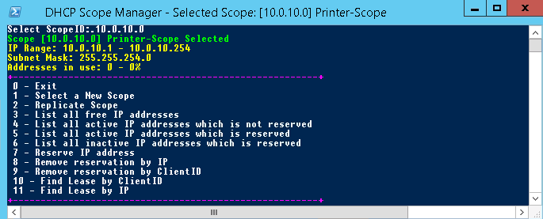

# DHCP Scope Manager
A PowerShell script to easily manage often used tasks in an DHCP Scope

**Description**  
  This scipt is ment to run directly on the HDCP server to manage an HDCP scope as an alternative to the default DHCP GUI interface.
  The biggest advantage is the ability to search rather than look in lists for specific IP addresses or Client IDs.
  Currently only supports IPv4.
  
**Requirements**
* Windows PowerShell (tested on 4)
* DhcpServer PowerShell module (tested on v2.0.0.0)
  https://docs.microsoft.com/en-us/powershell/module/dhcpserver/
* Windows server 2012 or newer

**Screenshots**  
Menu of running the script

**Changelog**  
* 10.07.2018
    * Release
